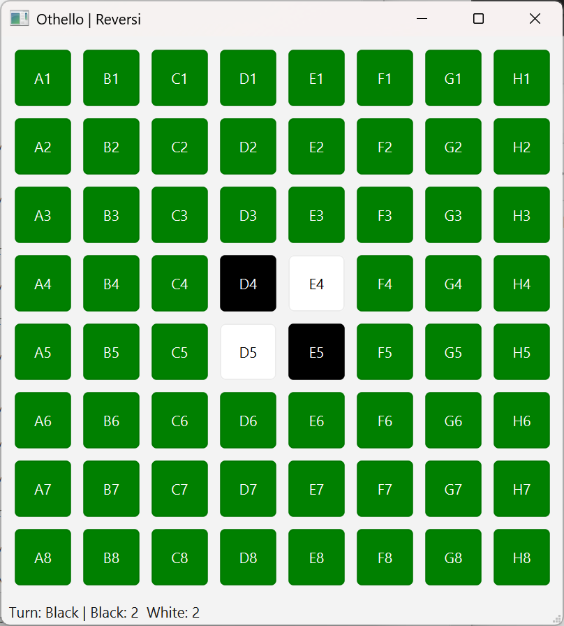

# Othello / Reversi with PyQt6 GUI

A simple Othello (Reversi) game implemented with **Python** and
**PyQt6**.\
This project provides an interactive 8×8 board, real-time score display,
turn updates, automatic pass detection, and full game logic powered by a
companion CLI engine (`OthelloCLI.py` by Martin Lester).

------------------------------------------------------------------------

## Features

-   Fully playable Othello/Reversi game
-   Click-based move input
-   Automatic turn passing when the opponent has no legal moves
-   Live score display (Black & White)
-   Status bar messages for game progress & illegal moves
-   Clean PyQt6 grid layout
-   Decoupled GUI and game logic (GUI → `OthelloGUI.py`, Logic →
    `OthelloCLI.py`)

------------------------------------------------------------------------

## Requirements

Make sure you have:

-   **Python 3.10+**
-   **PyQt6**

Install dependencies with:

``` bash
pip install PyQt6
```

------------------------------------------------------------------------

## How to Run

Clone the repository:

``` bash
git clone https://github.com/emreaslan15/othello-qt.git
cd othello-qt
```

Run the GUI:

``` bash
python OthelloGUI.py
```

Make sure `OthelloCLI.py` is in the same directory, as the GUI imports
it for game logic.

------------------------------------------------------------------------

## How It Works

### `OthelloGUI.py`

-   Builds an 8×8 grid of clickable `QPushButton` cells\
-   Each cell renders as:
    -   🟩 empty square
    -   ⚪ white piece
    -   ⚫ black piece
-   Handles turn switching, board updates, and messages

### Move Handling

When a cell is clicked:

1.  Coordinates are converted (A--H, 1--8 → board indices)
2.  Move is passed to the `Othello` engine from `OthelloCLI.py`
3.  If valid:
    -   Board updates
    -   Turn updates
    -   Detects if the opponent must pass
4.  If invalid:
    -   Status bar shows **Illegal move**

------------------------------------------------------------------------

## Project Structure

    .
    ├── OthelloGUI.py   # PyQt6 user interface
    ├── OthelloCLI.py   # Game rules & logic (user-provided)
    └── README.md

------------------------------------------------------------------------

## Screenshots



------------------------------------------------------------------------

## License

Licenced under the MIT License
